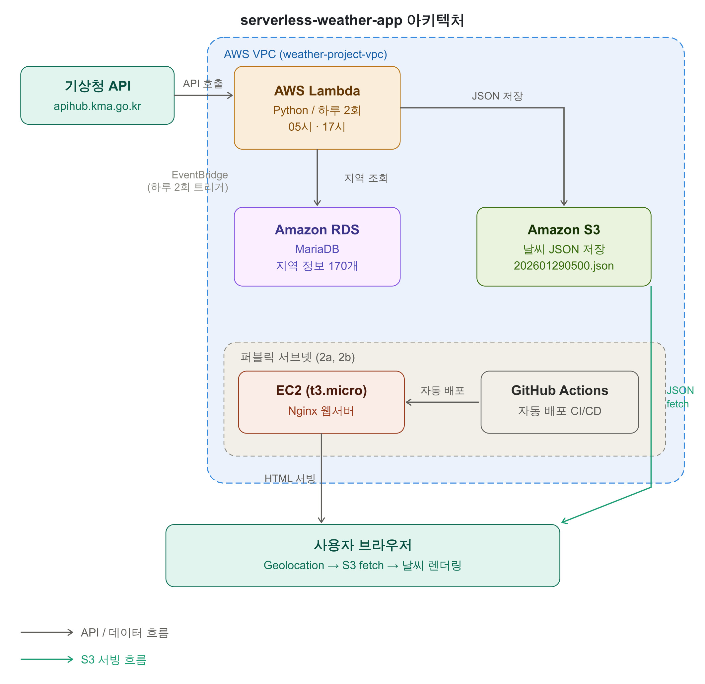
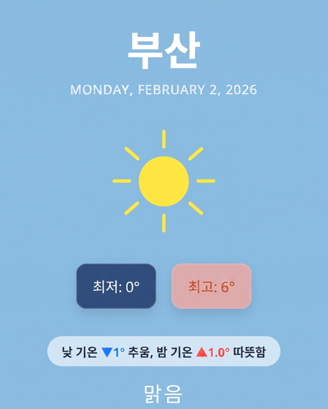

# serverless-weather-app


기상청 공공 API를 기반으로 전국 170여 개 지역의 날씨 정보를 수집·가공하여 제공하는 서버리스 날씨 웹 애플리케이션입니다. AWS Lambda가 하루 2회 자동으로 데이터를 수집해 S3에 저장하고, 웹 프론트엔드는 S3에서 직접 데이터를 불러와 렌더링합니다.

---

## 아키텍처

<!-- 아키텍처 다이어그램 이미지 -->


> 이미지가 보이지 않는 경우 `docs/architecture.png` 파일을 확인해주세요.

---

## 핵심 구현 내용

**서버리스 데이터 파이프라인**
AWS Lambda가 기상청 API를 호출해 전국 170여 개 지역의 날씨 데이터를 수집하고, S3에 날짜별 JSON 파일(`20260129.json`)로 저장합니다. 웹 서버는 연산 없이 S3 JSON만 읽어 렌더링하기 때문에 EC2 부하를 최소화했습니다.

**하루 2회 업데이트 전략**
기상청은 05시·11시·17시 3회 예보를 발표하지만, 05시와 11시 데이터가 일부 겹쳐 중복이 발생합니다. 이를 방지하기 위해 **05시·17시 두 차례만** 수집하도록 설계해 데이터 효율성과 API 비용을 동시에 최적화했습니다.

**RDS 기반 지역 정보 관리**
Lambda 실행 제한 시간(15분) 내에 170개 지역 데이터를 처리하기 위해 지역 코드·좌표 정보를 RDS에 미리 적재했습니다. S3에서 매번 읽어오는 방식보다 조회 속도가 빠르고 지역 추가 시 DB만 수정하면 되는 확장성을 확보했습니다.

**위치 기반 날씨 표시**
브라우저 Geolocation API로 사용자 현재 위치를 파악하고, 위도·경도를 기반으로 가장 가까운 예보 구역을 찾아 해당 지역 날씨를 표시합니다. 위치 권한을 거부하거나 조회에 실패하면 기본값(서울)으로 자동 전환합니다.

**GitHub Actions CI/CD**
코드를 로컬에서 수정 후 GitHub에 push하면 GitHub Actions가 자동으로 EC2에 배포합니다.

---

## 기술 스택

| 분류 | 기술 |
|---|---|
| **Frontend** | HTML, CSS, JavaScript |
| **Web Server** | Nginx (EC2) |
| **Data Pipeline** | AWS Lambda (Python) |
| **Storage** | Amazon S3 (JSON 데이터 저장 및 서빙) |
| **Database** | Amazon RDS (MariaDB) — 지역 정보 관리 |
| **Infra** | AWS VPC, EC2, Security Group, IGW |
| **CI/CD** | GitHub Actions (로컬 → GitHub → EC2 자동 배포) |
| **External API** | 기상청 공공 API (apihub.kma.go.kr) |

---

## 인프라 구성

| 구성 요소 | 설정 |
|---|---|
| **VPC** | `weather-project-vpc` (10.0.0.0/16) |
| **퍼블릭 서브넷** | `2a`, `2b` — 고가용성을 위해 2개 AZ에 분산 배치 |
| **프라이빗 서브넷** | `2c` — 내부 리소스 보호 |
| **EC2** | `weather-server` (t3.micro) — 퍼블릭 서브넷 2a 배치 |
| **RDS** | MariaDB — 서브넷 그룹 (2a + 2b AZ) |
| **S3** | `weater-project-s3-bucket-01` — 날씨 JSON 저장 및 서빙 |
| **IGW** | `weather-project-igw` — 퍼블릭 서브넷 인터넷 연결 |

---

## DB 구조

### regions 테이블
예보 구역 기준 정보 테이블로, 국내외 지역 추가를 고려해 확장 가능하게 설계했습니다.

| 컬럼명 | 타입 | 설명 |
|---|---|---|
| `regid` | VARCHAR(20) | 예보구역코드 (PK) |
| `region_name` | VARCHAR(50) | 지역명 |
| `broad_region` | VARCHAR(50) | 광역 구분 (NULL 허용) |

### region_coordinates 테이블
지역별 위도·경도 좌표 테이블입니다. `regions` 테이블의 `regid`를 외래키로 참조합니다.

| 컬럼명 | 타입 | 설명 |
|---|---|---|
| `regid` | VARCHAR(20) | 예보구역코드 (PK, FK) |
| `lat` | DOUBLE | 위도 |
| `lon` | DOUBLE | 경도 |

### region_view (뷰)
Lambda가 API 호출 시 필요한 정보만 모아 조회할 수 있도록 `regions`와 `region_coordinates`를 JOIN한 뷰 테이블입니다.

---

## 데이터 흐름

```
[기상청 API]
     │  하루 2회 (05시, 17시)
     ▼
[AWS Lambda (Python)]
  ├─ RDS에서 지역 정보 조회 (170개 지역)
  ├─ 기상청 API 호출 (지역별 예보 데이터 수집)
  ├─ JSON 가공 및 좌표 정보 결합
  └─ S3에 날짜별 JSON 저장 (예: 202601290500.json)
     │
     ▼
[Amazon S3]
  └─ 날씨 JSON 파일 서빙
     │
     ▼
[브라우저 (JavaScript)]
  ├─ Geolocation API로 사용자 위치 파악
  ├─ S3 JSON 파일 fetch
  ├─ 위도·경도 기반 가장 가까운 지역 매칭
  └─ 현재 날씨 / 최저·최고 기온 / 어제 대비 비교 렌더링
```

---

## 날씨 JSON 데이터 구조

기상청 API 응답을 가공해 S3에 저장하는 JSON 포맷입니다.

```json
{
    "announceTime": 202601300500,
    "numEf": 1,
    "regId": "11B10101",
    "rnSt": 20,
    "rnYn": 0,
    "ta": "-2",
    "wd1": "NW",
    "wd2": "N",
    "wdTnd": "1",
    "wf": "구름많음",
    "wfCd": "DB03",
    "wsIt": "1",
    "region_name": "서울",
    "latitude": 37.56356944,
    "longitude": 126.9800083
}
```

| 필드 | 설명 |
|---|---|
| `announceTime` | 발표시각 (년월일시분) |
| `numEf` | 발효번호 — `1`: 오늘 대표 예보 |
| `ta` | 예상 기온 (℃) |
| `wf` / `wfCd` | 날씨 상태 / 코드 (DB01: 맑음, DB03: 구름많음, DB04: 흐림) |
| `rnYn` | 강수형태 (0: 없음, 1: 비, 2: 비/눈, 3: 눈, 4: 소나기) |

---

## 서비스 화면

<!-- 앱 화면 이미지 -->


> 이미지가 보이지 않는 경우 `docs/result.png` 파일을 확인해주세요.

---


